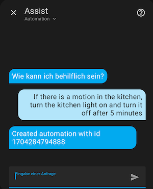

# Home Assistant OpenAI Automation Conversation Agent

Custom component for [Home Assistant](https://www.home-assistant.io) to enable conversation with an [OpenAI](https://openai.com) Conversation Agent to create automations. This is a proof of concept and similar to the included OpenAI/ChatGPT agent but actually changes the system state, i.e. writes to the automations.yaml file. So be careful and always check the modifications!

The component passes your binary_sensors and lights to the ChatGPT prompt, to generate automations with the proper entity ids.

## Custom Component Installation

1. Copy the openai_automation_conversation folder to your custom_components folder in your Home Assistant config directory. If you don't have a custom_components directory, create one in the same directory as your configuration.yaml file.
2. Reload Home Assistant
3. Create an OpenAI account and fetch a token
4. In Home Assistant integrations page add the integration _OpenAI Automatic Conversation_ and input the token from step 3
5. Head to voice assist and add a new conversation agent, pick a name and select _OpenAI Automatic Conversation_ agent

Now in the chat window you can select your created agent and input queries

## Example usage

In this example lets create an automation to trigger a light with a motion sensor and turn it off again after a delay:



Head over to the automations and check the new item. In my case this configuration:

```
alias: Motion activated kitchen light
trigger:
  - platform: state
    entity_id: binary_sensor.bewegungsmelder_kuche
    from: "off"
    to: "on"
condition: []
action:
  - service: light.turn_on
    entity_id: light.kuche
  - delay: "00:05:00"
  - service: light.turn_off
    entity_id: light.kuche
mode: single
```

Have fun with your own automations and feel free to fork and suggest improvements.
